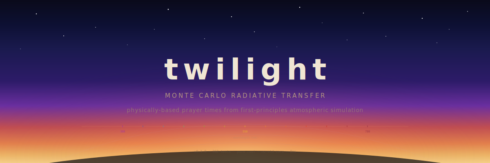

<p align="center">
  
</p>

<p align="center">
  <a href="https://github.com/Muno459/twilight/actions"></a>
  <a href="https://github.com/Muno459/twilight"></a>
  <a href="#license"></a>
</p>

<h3 align="center">The most accurate dawn and dusk calculator ever built.</h3>
<p align="center">Your prayer app doesn't know if it's cloudy.</p>

<br/>

`twilight` computes Fajr and Isha prayer times by simulating how sunlight actually scatters through the atmosphere. No lookup tables, no fixed depression angles. Photons in, prayer times out.

Monte Carlo radiative transfer through a 50-shell spherical atmosphere with Rayleigh scattering, five-species molecular gas absorption (O3, O2, H2O, NO2, O4 CIA from HITRAN), OPAC aerosols, cloud layers, atmospheric refraction via Snell's law, full Stokes vector polarization, terrain masking from Copernicus GLO-30 DEM, and light pollution modeling. Optional live weather from Open-Meteo. Optional JPL DE440 ephemeris for sub-arcsecond solar positioning. GPU acceleration on Metal, Vulkan, CUDA, and WebGPU.

30 ms on Apple Silicon. 938 tests.

## Why

Every prayer app hardcodes a solar depression angle. MWL says 18 degrees. Egypt says 15 degrees. Umm al-Qura says 19.5 degrees. They disagree because "when does twilight end?" depends on the atmosphere, not on a number someone picked in 1986.

```
Mecca, March equinox, clear sky:

  Fajr:   05:23   depression 14.97    (Egypt 15 says 05:23. Spot on.)
  Isha:   19:32   depression 14.83    (ISNA 18 says 19:45. Off by 13 min.)
```

Add urban aerosol haze and the answer shifts:

```
Mecca, March equinox, urban aerosol (AOD 0.30):

  Fajr:   05:32   depression 13.03    (+8 min vs clear sky)
  Isha:   19:25   depression 13.21    (-7 min vs clear sky)
```

Pull live weather and the engine accounts for today's actual O3 column, NO2 levels, aerosol loading, and cloud cover:

```
Padborg, Denmark, 2026-03-06, live weather:

  Fajr:   04:28   depression 14.05    AOD 0.11, O3 289 DU, clear sky
  Isha:   18:37   depression 13.59
```

Fixed angles can't account for this. The atmosphere matters.


## Quick start

```bash
cargo build --release

# Prayer times (clear sky)
./target/release/twilight-cli pray \
  --lat 21.4225 --lon 39.8262 --date 2024-03-20 --tz 3.0

# With live weather (AOD, cloud cover, O3/NO2 from Open-Meteo)
./target/release/twilight-cli pray \
  --lat 21.4225 --lon 39.8262 --date 2024-03-20 --tz 3.0 --weather

# With terrain masking (Copernicus GLO-30 DEM, auto-downloaded)
./target/release/twilight-cli pray \
  --lat 21.4225 --lon 39.8262 --date 2024-03-20 --tz 3.0 --terrain

# With light pollution (Bortle class or VIIRS radiance)
./target/release/twilight-cli pray \
  --lat 55.653 --lon 12.412 --date 2026-03-06 --bortle 7

# Manual aerosols and/or clouds
./target/release/twilight-cli pray \
  --lat 21.4225 --lon 39.8262 --date 2024-03-20 --tz 3.0 \
  --aerosol urban --cloud thin-cirrus

# Multi-scatter mode (exact order 1 + MC orders 2+)
./target/release/twilight-cli pray \
  --lat 21.4225 --lon 39.8262 --date 2024-03-20 --tz 3.0 \
  --scattering hybrid --photons 500

# Full Stokes polarized RT (default is scalar for speed)
./target/release/twilight-cli mcrt \
  --lat 21.4225 --lon 39.8262 --sza-start 90 --sza-end 108 \
  --scattering hybrid --polarized

# Solar position with JPL DE440 vs SPA comparison
./target/release/twilight-cli solar \
  --lat 21.4225 --lon 39.8262 --date 2024-06-15 --tz 3 \
  --de440 data/de440.bsp

# Raw spectral radiance across twilight
./target/release/twilight-cli mcrt \
  --lat 21.4225 --lon 39.8262 --sza-start 90 --sza-end 108
```

Aerosol types: `continental-clean`, `continental-average`, `urban`, `maritime-clean`, `maritime-polluted`, `desert`.

Cloud types: `thin-cirrus`, `thick-cirrus`, `altostratus`, `stratus`, `stratocumulus`, `cumulus`.

`--weather` fetches current conditions from [Open-Meteo](https://open-meteo.com/) (free, no API key). It maps measured AOD at 550nm to aerosol optical properties, cloud cover by altitude to cloud layers, and surface O3/NO2 concentrations from CAMS to gas absorption overrides (O3 column in Dobson Units, NO2 number density).


## How it works

<details>
<summary>Full pipeline</summary>

**1. Solar position.** NREL SPA (VSOP87, +/-0.0003 degrees) as default. Optional JPL DE440 ephemeris backend with a pure Rust DAF/SPK reader, Chebyshev interpolation, IAU precession-nutation, and ICRF-to-topocentric conversion. DE440 validated to 8 meters vs JPL Horizons. Binary search for sunrise/sunset. Persistent twilight detection at high latitudes.

**2. Atmosphere.** 50 concentric spherical shells, 0 to 100 km. Rayleigh scattering via Bodhaine (1999) with exact Lorentz-Lorenz. Five-species molecular gas absorption: O3 (Serdyuchenko 2014, 11-temperature), O2 (HITRAN line-by-line Voigt, A-band at 762nm), H2O (HITRAN LBL Voigt, 720nm), NO2 (HITRAN XSC, two temperatures), O4 CIA (HITRAN 2024 collision-induced absorption). All cross-sections use bilinear pressure-temperature interpolation where applicable. OPAC aerosol climatology (6 types) with Angstrom extinction and Henyey-Greenstein phase function. Cloud layers (6 types: cirrus to cumulus). Lambertian ground reflection with configurable albedo. Atmospheric refraction via Snell's law at every shell boundary.

**3. Radiative transfer.** Three modes: (a) single-scatter LOS integration with analytical shadow rays (30 ms, deterministic); (b) backward Monte Carlo with next-event estimation (all orders, noisy); (c) hybrid -- exact single-scatter + MC secondary chains with upward-biased importance sampling for orders 2+. Full Stokes vector polarized RT with Rayleigh and Henyey-Greenstein Mueller matrices, toggled via `--polarized` flag. 41 wavelengths, 380 to 780 nm.

**4. Terrain masking.** Copernicus GLO-30 DEM tiles (auto-downloaded) or national LiDAR (Danish SDFI backend). Computes a 360-point horizon profile and adjusts the effective solar zenith angle at each azimuth. Mountains and buildings that block the horizon shift prayer times.

**5. Light pollution.** Garstang RT skyglow model with spectral LED/HPS lamp profiles. Accepts Bortle class (1-9) or VIIRS nighttime radiance. Estimates zenith brightness added to the twilight signal and the resulting shift in prayer times.

**6. Vision model.** CIE photopic/scotopic/mesopic luminance. Spectral centroid classifies twilight color: blue, white (*shafaq al-abyad*), orange, red (*shafaq al-ahmar*), dark.

**7. Threshold search.** Coarse scan (0.5 degrees) then fine scan (0.1 degrees) around crossings. Fajr = mesopic threshold. Isha al-abyad = mesopic threshold. Isha al-ahmar = red-band threshold. SZA converted to clock time via SPA binary search.

**8. GPU acceleration.** Four hand-tuned backends: Metal (.metal shaders, objc2-metal host), Vulkan (GLSL->SPIR-V, ash host), CUDA (.cu shaders, cudarc host), and wgpu (.wgsl shaders for WASM/browsers). Gas absorption is CPU-prebaked into shell optics before GPU upload. Cross-backend parity tests ensure all backends produce identical physics.

</details>


## Crates

| Crate | What |
|---|---|
| [`twilight-core`](crates/twilight-core) | Physics kernel. `#![no_std]`, `#![forbid(unsafe_code)]`, zero heap. Geometry, Rayleigh/HG scattering, full Stokes Mueller matrices, atmosphere model, atmospheric refraction, molecular gas absorption (5 species, Voigt LBL), single-scatter integrator, backward MC tracer, hybrid multi-scatter engine. |
| [`twilight-solar`](crates/twilight-solar) | NREL SPA (+/-0.0003 degrees) + JPL DE440 ephemeris (+/-0.001"). Pure Rust DAF/SPK reader, Chebyshev interpolation, IAU precession-nutation. |
| [`twilight-data`](crates/twilight-data) | Embedded data. US Std 1976 profiles, TSIS-1 solar spectrum, OPAC aerosols (6 types), cloud types (6 types), atmosphere builder with gas absorption pipeline. |
| [`twilight-threshold`](crates/twilight-threshold) | CIE vision model, mesopic luminance, twilight color classification, Fajr/Isha threshold detection. |
| [`twilight-weather`](crates/twilight-weather) | Live weather. Open-Meteo client for AOD, cloud cover, visibility, surface O3/NO2. Gas composition mapping (O3 column DU, NO2 number density). |
| [`twilight-terrain`](crates/twilight-terrain) | Terrain masking. Copernicus GLO-30 DEM + Danish SDFI LiDAR. GeoTIFF parser, horizon profile computation. |
| [`twilight-skyglow`](crates/twilight-skyglow) | Light pollution. Garstang RT skyglow model, spectral LED/HPS profiles, Bortle classification, VIIRS radiance mapping. |
| [`twilight-gpu`](crates/twilight-gpu) | GPU backends. Metal, Vulkan, CUDA, wgpu. Packed atmosphere buffers, cross-backend oracle tests, benchmarks. |
| [`twilight-cpu`](crates/twilight-cpu) | CPU backend. Rayon parallelism, simulation driver, two-pass adaptive prayer time pipeline. |
| [`twilight-ffi`](crates/twilight-ffi) | C FFI. `cdylib` + `staticlib` for iOS/Android/Flutter. |
| [`twilight-cli`](crates/twilight-cli) | CLI. `solar`, `mcrt`, `pray` subcommands. |

`twilight-core` is `no_std` with no `Vec`, `String`, or `Box`. Everything is `[f64; 64]`. Same physics code runs on a phone, in a browser, or on a GPU.

See [`crates/`](crates/) for the full dependency graph and per-crate documentation.


## Tests

938 tests, ~14 seconds. `cargo test --workspace`

| Crate | Tests | Notes |
|---|---|---|
| `twilight-core` | 311 | Geometry, scattering, Mueller matrices, gas absorption (74), MC tracer, hybrid engine |
| `twilight-data` | 153 | Profiles, cross-sections, builder, gas absorption integration, aerosol/cloud combos |
| `twilight-gpu` | 99 | Buffer packing, oracle validation, Metal, Vulkan, cross-backend parity, benchmarks |
| `twilight-cpu` | 82 | Simulation, pipeline end-to-end (Mecca, London), parallel tracer convergence |
| `twilight-solar` | 73 | SPA reference case, DE440 vs Horizons, zenith crossing, polar edge cases |
| `twilight-threshold` | 72 | CIE vision, luminance, color classification, threshold interpolation |
| `twilight-skyglow` | 69 | Garstang RT, Bortle mapping, LED/HPS spectra, angular enhancement |
| `twilight-terrain` | 47 | GeoTIFF parsing, horizon computation, Copernicus tiles, effective SZA |
| `twilight-weather` | 45 | API formatting, aerosol/cloud mapping, gas composition (7), NO2 conversion |


## Roadmap

- [x] Solar position (SPA + DE440), atmosphere model, single-scatter engine
- [x] CIE vision model, prayer time thresholds, adaptive pipeline
- [x] Surface albedo, OPAC aerosols (6 types), cloud layers (6 types)
- [x] Multiple scattering: backward MC, hybrid single + MC orders 2+
- [x] Live weather via Open-Meteo (AOD, cloud cover, visibility)
- [x] Terrain masking (Copernicus GLO-30 DEM, Danish LiDAR)
- [x] Light pollution (Garstang RT, spectral LED/HPS, Bortle class)
- [x] GPU backends (Metal, Vulkan, CUDA, wgpu) with cross-backend parity
- [x] Atmospheric refraction via Snell's law at shell boundaries
- [x] Full Stokes vector polarized radiative transfer
- [x] Molecular gas absorption: O3, O2, H2O, NO2, O4 CIA (HITRAN data, Voigt LBL)
- [x] Atmospheric composition API: live O3/NO2 from CAMS via Open-Meteo
- [ ] Satellite cloud fields (GOES/Himawari/Meteosat)
- [ ] Neural surrogate model for real-time mobile inference
- [ ] Mobile SDKs (iOS/Android), WASM demo


## License

MIT OR Apache-2.0
