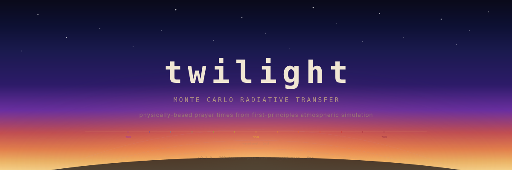

<p align="center">
  
</p>

<p align="center">
  <a href="https://github.com/Muno459/twilight"></a>
  <a href="https://github.com/Muno459/twilight"></a>
  <a href="#validation"></a>
  <a href="#license"></a>
</p>

<h3 align="center">A physically-based dawn and dusk calculator.</h3>
<p align="center">Fajr and Isha computed the way the Quran defines them, not from a fixed angle.</p>

<br/>

> *"...and eat and drink until the **white thread** of dawn becomes **distinct to you** from the **black thread** of night..."* (al-Baqarah 2:187)

## What this is

Prayer apps compute Fajr with a fixed solar depression angle: MWL uses 18
degrees, Egypt 15, Umm al-Qura uses offsets. They disagree because "when
does dawn become visible?" is not a single number. It depends on the
atmosphere, the clouds, the moon, the city lights, and the human eye.

The ayah describes something more specific than an angle: a band of light
on the horizon becoming *distinct to you* from the night beside it. That is
a visual detection event, and it can be computed.

`twilight` simulates the night sky for your location and date, models a
dark-adapted human observer watching the eastern horizon, and reports the
moment the white thread of dawn becomes distinct and spreads, exactly as
the verse and the sunnah describe it. It also reports the false dawn (the
narrow "wolf's tail" that rises before the true dawn) and both Isha
definitions (the disappearance of the red and the white twilight).

The sky it simulates is tonight's sky, not a textbook one: the forecast at
the prayer hour, satellite-measured cloud cover and city light, the real
moon from the JPL ephemeris, and an **AI 3D cloud reconstruction**: a
neural network trained on spaceborne cloud radar rebuilds the actual
three-dimensional cloud field over your head from the latest geostationary
satellite scan, so the light transport sees clouds at their true heights
and thicknesses, not a guessed average.

## Quick start

```bash
cargo build --release

# Clear-sky prayer times, anywhere on Earth. The timezone (including
# whether DST is active on that date) is determined automatically from
# the coordinates via the IANA database; --tz overrides if needed.
./target/release/twilight-cli pray --lat 21.4225 --lon 39.8262 --date 2026-06-13

# Production: live weather at the prayer hour, satellite clouds, measured
# skyglow, JPL ephemeris, multi-scatter transport
./target/release/twilight-cli pray --lat 54.82 --lon 9.36 --date 2026-06-13 \
  --weather --skyglow --de440 data/de440.bsp --scattering hybrid
```

Output (Mecca, clear sky):

```
  Fajr (khayt al-abyad): 04:29:09  (SZA 104.85°, depression 14.85°)
    └ white thread distinct from black + lateral spread (2:187, mustatir)
    └ false dawn (al-fajr al-kadhib) visible from 04:27:14 - do not pray Fajr yet
  Isha (shafaq ahmar):   20:15:48  (depression 15.50°)
    └ red band no longer distinct - Shafi'i/Maliki/Hanbali (primary)
  Isha (shafaq abyad):   20:25:56  (depression 17.46°)
    └ white band no longer distinct - Hanafi
```

Conventional fixed-angle times and a legacy absolute-threshold method are
printed below these for comparison.

## Validation

Two independent kinds of validation: the light transport is checked against
reference radiative-transfer codes, and the visibility criterion is checked
against published human dawn-observation campaigns.

**Criterion vs field campaigns** (clear sky, calibrated once at Mecca):

| Event | Engine | Independent measurement |
|---|---|---|
| Fajr sadiq, Mecca | **14.85°** | KACST desert campaign 14.6 ± 0.3° · Hail 14.0 ± 0.3° (white-thread bound 14.66°) · Aswan calibrated camera 14.90 ± 0.17° |
| Isha al-abyad, Mecca | **17.46°** | SQM twilight-end 17.99 ± 0.16° · classical muwaqqit mode 17° |
| Isha al-ahmar, Mecca | **15.50°** | visual literature 12 to 15° ("colors gone before 15") |
| **Fajr, Birmingham UK, June** (out-of-sample, zero retuning) | **12.50°** | **OpenFajr (CCD camera + 19-member scholar/observer panel): 12.3 to 12.7°** |

The Birmingham row matters most: the seasonal "summer relaxation" that UK
scholars apply as a hand-rule (14.5° in winter, about 12.5° in summer)
emerges from the physics across 31 degrees of latitude with no additional
tuning.

**Transport vs libRadtran** (Rayleigh, shape-normalized; details in `validation/RESULTS.md`):

| Reference | Regime | Agreement |
|---|---|---|
| DISORT (pseudospherical, 16 streams) | SZA 60 to 90° | **2.6 to 3.5 % median** |
| MYSTIC (spherical Monte Carlo) | SZA 95° | **+6.5 % / +2.9 %** (450/650 nm) |
| MYSTIC | SZA ≥ 98° | noise-limited on both sides; a large-photon campaign is planned |

## Live data

Everything measurable is measured, fetched automatically, with documented
fallbacks:

| Quantity | Source | Cadence |
|---|---|---|
| Weather, aerosols, cloud cover at the prayer hour | Open-Meteo forecast + CAMS air quality | hourly forecast |
| Cloud optical thickness and top height | NASA GIBS, MODIS; sampled at the observer and 50 to 300 km along the sun azimuth, where the twilight light path actually crosses the cloud field | daily |
| Cloud water path and particle size (phase typing, gap filling) | NASA GIBS, MODIS microphysics | daily |
| 3D ice-cloud vertical profile | cloud3d model on GOES-19/18 (anonymous S3) or Meteosat-9 SEVIRI (EUMETSAT Data Store) | 10 to 15 min scans |
| Artificial skyglow | Lorenz 2024 propagated atlas, cross-checked by live VIIRS Black Marble nighttime lights | atlas + daily |
| Solar activity (airglow driver) | NOAA SWPC F10.7 radio flux | daily measured |
| Sun and Moon | JPL DE440 ephemeris (exact lunar parallax, true phase angle, real distance); NREL SPA fallback | static file |
| Zodiacal light | Leinert 1998 Table 16, the measured grid, embedded and regenerable | embedded |
| Integrated starlight | Pioneer 10/11 sky maps (Toller 1981), digitized from the publisher scan | embedded |
| Moonlight | Krisciunas and Schaefer 1991, fed the DE440 lunar state | computed |
| Terrain horizon | Copernicus GLO-30 DEM | cached tiles |

## AI 3D cloud reconstruction

Clouds are the single largest physical influence on when dawn becomes
visible, and a 2D satellite picture cannot say how HIGH or how THICK they
are. So `twilight` runs the [cloud3d](https://huggingface.co/csaybar/cloud3d)
neural network (a SegFormer trained on CloudSat's spaceborne cloud radar,
ESA Cloud3DTACO dataset, arXiv:2511.04773) on the latest geostationary
satellite scan and reconstructs the full 3D cloud volume: an 80-level
vertical ice-water-content profile for every pixel, on a 240 m vertical
grid up to 19 km.

```bash
# Americas/Pacific: GOES-19/18, no account needed (anonymous AWS S3)
./target/release/twilight-cli pray ... --cloud3d auto

# Europe/Africa/Asia: Meteosat-9 SEVIRI via a free EUMETSAT account
pip install eumdac satpy torch
eumdac set-credentials <consumer-key> <consumer-secret>   # eoportal.eumetsat.int
python3 tools/cloud3d_seviri.py --lat 54.82 --lon 9.36 --azimuth 45 \
  --out profile.json --png3d clouds3d.png
./target/release/twilight-cli pray ... --cloud3d profile.json
```

The `--png3d` flag renders the reconstructed volume as a true 3D scene:
cloud isosurfaces colored by altitude, standing on the actual satellite
image as the ground plane. The engine samples the volume along the sun
azimuth (where the twilight light path actually crosses the cloud field),
collapses it into vertical layers at their measured heights, and rescales
the total amplitude to the MODIS-measured optical thickness when one is
available: structure from the AI reconstruction, amplitude from direct
measurement. SEVIRI is the instrument the model was trained on; GOES uses
the eleven nearest-wavelength channels.

### More options

```bash
twilight-cli pray ... --terrain               # Copernicus DEM horizon masking
twilight-cli pray ... --bortle 7              # manual skyglow (or --radiance)
twilight-cli pray ... --aerosol urban --cloud thin-cirrus
twilight-cli pray ... --photons 500           # more MC rays per LOS step
twilight-cli pray ... --cpu                   # skip the Metal GPU
twilight-cli pray ... --fast                  # scalar mode, skip polarization
twilight-cli mcrt  --lat 21.42 --lon 39.83 --sza-start 90 --sza-end 108
twilight-cli solar --lat 21.42 --lon 39.83 --date 2026-06-15 --tz 3 --de440 data/de440.bsp
```

## How it works

### The criterion

For every scanned solar depression the engine simulates seven sky patches:
five across the dawn band at 3° altitude spanning ±18° of the solar azimuth,
plus dark reference patches at ±100°. The geometry comes from measurement:
the twilight arch sits at 2.66 ± 0.23° altitude (Aswan camera campaign), the
true-dawn band is roughly 30 to 40° wide at the moment of distinctness
(Ilyas; the Hail observers), and the false dawn's zodiacal wedge is about
20° wide at its base (Sultan).

Each patch's brightness is the sum of simulated twilight, the
direction-dependent celestial background (zodiacal light, starlight,
airglow, moonlight), and skyglow. Detection asks the question the ayah
asks: has the growth of each band patch above its own deep-night baseline
become distinct, as a Weber contrast against the reference-sky adaptation,
simultaneously across the full lateral extent? When only the central
patches pass, that is the false dawn; when the whole band passes, that is
Fajr sadiq. Isha mirrors the test as a disappearance, with the red channel
gated at the cone threshold (below about 10⁻³ cd/m² rods see no color, so
there is no red shafaq to lose).

A relative criterion has a quiet superpower: systematic errors that
multiply both patches (absolute radiometric scale, uniform cloud cover,
uniform skyglow) largely cancel in the ratio. It also needs no special
handling at high latitudes: the test is already relative to tonight's sky,
so brightness-based times exist wherever the sky physically brightens
(Padborg at 54.8° N in June: Fajr 02:55 inside persistent twilight).

One calibration layer is stated openly. Laboratory psychophysics predicts
the eye should already see the dawn's photometric excess at depression 17
to 18°; every field campaign shows it does not, because the dawn at that
depth is a borderless gradient spread over tens of degrees (photometers
detect it, people do not). The factor bridging that gap is calibrated once
against the Mecca campaign cluster and then held fixed worldwide. The
Birmingham row in the validation table is the test of that choice.

Set `TWILIGHT_KHAYT_DEBUG=1` to dump the per-azimuth contrast-margin curves
of any run.

### The transport

The sky itself is computed by backward Monte Carlo radiative transfer
through a 56-shell spherical atmosphere reaching 150 km: Rayleigh
scattering, five-species molecular absorption (O3, NO2, O2, H2O, O4 CIA
from HITRAN/Serdyuchenko data), OPAC-style aerosols, delta-Eddington cloud
transport, full Stokes polarization, and Snell refraction at shell
boundaries, at 41 wavelengths from 380 to 780 nm.

First-order scattering is evaluated as an exact deterministic integral.
The entire Monte Carlo budget goes to the multiple-scattering field, which
is all that exists at Fajr depth, where the line of sight lies fully inside
Earth's shadow. The estimator stack (next-event estimation, one-sample-MIS
seeding, forced collisions, exponential transform, Dwivedi sampling, weight
windows, splitting, bidirectional subpaths, hero-wavelength spectral MIS)
is exactly unbiased and held to that standard by an adversarial audit
process and regression-gated CPU/GPU parity tests.

A full computed day runs about 430 million photon chains: roughly 520 sky
patches (depression scan × view fan × independent seeds), each tracing
20,000 chains per wavelength across 41 wavelengths, with every scattering
event firing a refracted shadow ray toward the sun. On an Apple-Silicon
GPU (Metal) this takes minutes.

## Architecture

```
crates/
  twilight-core       MC transport kernel (#![no_std])
  twilight-data       atmosphere builder: USSA-76 + thermosphere to 150 km,
                      prebaked cross-sections, aerosols, cloud optics
  twilight-solar      NREL SPA, pure-Rust JPL DE440 SPK reader, lunar
                      ephemeris, earth rotation
  twilight-threshold  CIE mesopic/scotopic luminance, contrast thresholds,
                      night-sky background from measured tables, crossing fits
  twilight-cpu        pipeline: K-seed scans, the khayt fan, crossing to time
  twilight-gpu        Metal port of the full estimator, parity-gated
  twilight-weather    Open-Meteo, GIBS satellite layers, cloud3d, F10.7
  twilight-skyglow    Lorenz atlas, VIIRS Black Marble, Garstang model
  twilight-terrain    Copernicus DEM horizon profiles
  twilight-ffi        C FFI (minimal)
  twilight-cli        the twilight-cli binary
tools/
  validate_libradtran.py   DISORT/MYSTIC cross-validation harness
  cloud3d_profile.py       GOES to cloud3d 3D profiles (+ 3D renders)
  cloud3d_seviri.py        Meteosat SEVIRI to cloud3d (EUMETSAT Data Store)
  gen_*.py                 every embedded data table is regenerable from source
```

## Limitations

Treat computed times as **experimental for worship**; cross-check against
established local calendars. Known limits, stated plainly:

- **No field calibration of this engine's own output yet.** The criterion
  is calibrated against published campaigns. The measurement apparatus now
  ships with the engine (`twilight-cli sqm predict|compare` and the
  campaign protocol in docs/SQM_CAMPAIGN.md); what remains is a meter on a
  roof and clear nights.
- **Transport is 1D-spherical.** The 3D cloud field is measured in 3D but
  transported as horizontally uniform layers sampled along the sunlight's
  path. Cloud internal scattering is closed-form two-stream, not
  path-traced.
- **External transport validation reaches SZA ~98-100** (the absolute
  radiometric scale is proven to 1-2.5% at SZA 60-85; MYSTIC backward-mode
  agreement extends to ~100°), while the events live at 99 to 108°. The
  khayt criterion is a ratio and cancels most residual scale risk; deeper
  reference comparison is compute-limited on the reference side.
- **Shafaq al-ahmar** rests on the weakest observational dataset (no
  color-resolved modern campaign exists); the evening calibration leans on
  instrumental rather than panel data.

## Reproduce the validation

```bash
# libRadtran cross-validation (needs a libRadtran build; see tool docstring)
export LIBRADTRAN_DIR=~/tools-build/libRadtran-2.0.6
python3 tools/validate_libradtran.py --tier 1a --shape-only
python3 tools/validate_libradtran.py --tier 1b --shape-only

# Field-campaign checks
./target/release/twilight-cli pray --lat 21.4225 --lon 39.8262 --date 2026-06-13 \
  --de440 data/de440.bsp --scattering hybrid   # Mecca: 14.85/17.46/15.50
./target/release/twilight-cli pray --lat 52.44 --lon=-1.93 --date 2026-06-13 \
  --de440 data/de440.bsp --scattering hybrid   # Birmingham June: 12.50

# Full test suite (including the Metal GPU parity gates)
cargo test --workspace --release
cargo test -p twilight-gpu --release --features metal
```

## License

MIT OR Apache-2.0, at your option.

ولله الحمد. For the ummah.
